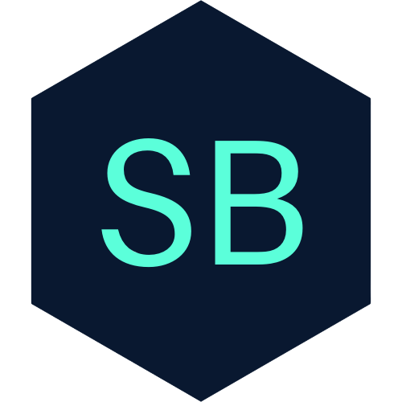

<div align="center">
  
</div>
<h1 align="center">
  Swapnil Babladkar — Portfolio
</h1>
<p align="center">
  Personal portfolio site for <a href="https://www.linkedin.com/in/swapnilbabladkar/" target="_blank">Swapnil Babladkar</a>, AI Platform Engineer, built with <a href="https://www.gatsbyjs.org/" target="_blank">Gatsby</a> and hosted on <a href="https://www.netlify.com/" target="_blank">Netlify</a> (and GitHub Pages).
</p>

<p align="center">
  <a href="https://swapnilbabladkar.netlify.app/" target="_blank"><strong>swapnilbabladkar.netlify.app</strong></a>
</p>

Design based on [Brittany Chiang](https://brittanychiang.com)'s [v4](https://github.com/bchiang7/v4) template — used with attribution per its license.

## 🛠 Installation & Set Up

1. Install the Gatsby CLI

   ```sh
   npm install -g gatsby-cli
   ```

2. Install and use the correct version of Node using [NVM](https://github.com/nvm-sh/nvm)

   ```sh
   nvm install
   ```

3. Install dependencies

   ```sh
   yarn
   ```

4. Start the development server

   ```sh
   npm start
   ```

## 🚀 Building and Running for Production

1. Generate a full static production build

   ```sh
   npm run build
   ```

1. Preview the site as it will appear once deployed

   ```sh
   npm run serve
   ```

## 🌐 Hosting

This site deploys to two places:

- **Netlify** — [swapnilbabladkar.netlify.app](https://swapnilbabladkar.netlify.app/). Already connected to this repo; every push to `main` triggers a build automatically via the Netlify dashboard/CLI. No extra setup needed.
- **GitHub Pages** — `.github/workflows/gh-pages.yml` builds the site with `gatsby build --prefix-paths` (using the `pathPrefix: '/portfolio-2022'` in `gatsby-config.js`) and publishes `public/` to the `gh-pages` branch on every push to `main`/`master`. To turn it on:
  1. Push this repo to GitHub (the workflow runs automatically).
  2. In the repo, go to **Settings → Pages**, set **Source** to the `gh-pages` branch (created by the workflow's first run), folder `/ (root)`.
  3. The site will be live at `https://swapnilbabladkar.github.io/portfolio-2022/`.
  4. If you ever rename the repo, update `pathPrefix` in `gatsby-config.js` to match.

## 🎨 Color Reference

| Color          | Hex                                                                |
| -------------- | ------------------------------------------------------------------ |
| Navy           |  `#0a192f` |
| Light Navy     |  `#112240` |
| Lightest Navy  |  `#233554` |
| Slate          |  `#8892b0` |
| Light Slate    |  `#a8b2d1` |
| Lightest Slate |  `#ccd6f6` |
| White          |  `#e6f1ff` |
| Green          |  `#64ffda` |
